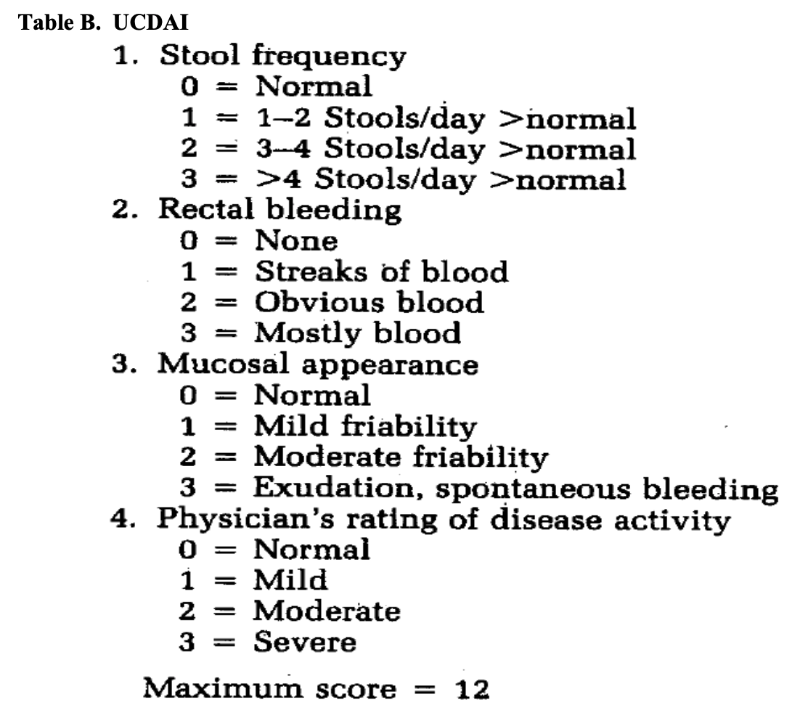

[Home](./index.html)

## Ulcerative Colitis
The primary endpoint for ulcerative colitis is measured by the following (straight form FDA's primary endpoint manual [@UlcerativeColitisClinical2016]):

## Obefazimod

Obefazimod started off as an HIV drug and now is an Ulcerative Colitis (UC) drug [@camposLongLastingControl2015] [@tazi2010]. Then in 2017, it was discovered to have anti-inflammatory properties. [@Chebli2017] They used dextran sulfate sodium to cause colitis in mice, and then administered their drug ABX464. They measured efficicacy by tracking IL-6, TNFα and MCP-1.

The paper starts by measuring the effectiveness of ABX464 for treating DSS-induced colitis. There 2 variables that they must manage, the ABX464 efficacy, and the efficacy of the DSS. As a result they have 4 total groups consisting of: {(no disease, no drug), (no diesease, drug), (disease, no drug), (disease,drug)}. Figure A describes the administration protocol. They give the drug for 8 days and then wait 3 days before analyzing the results. Figure B measures the relative weight of the mice. We can observe that when DSS is given, the weight begins to decline for the both the metylcellulose control and the ABX464. 

## References
