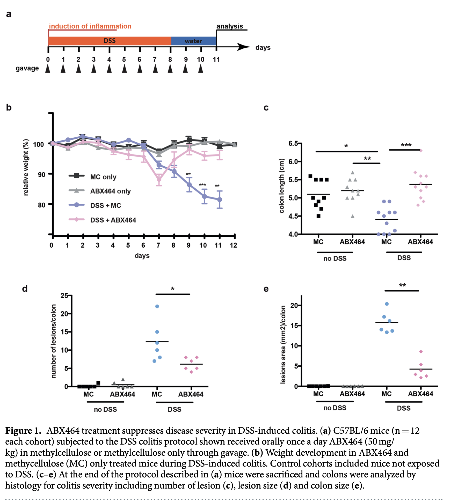
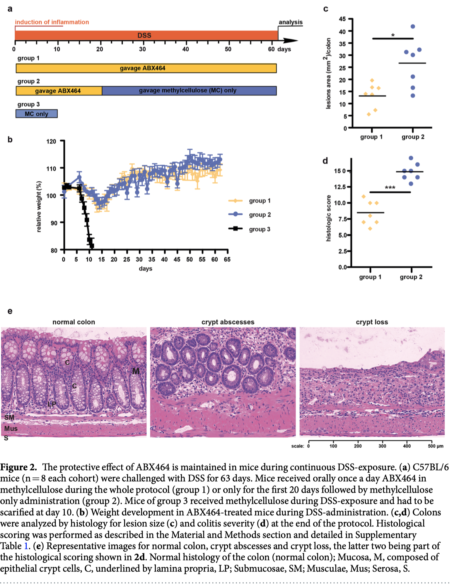
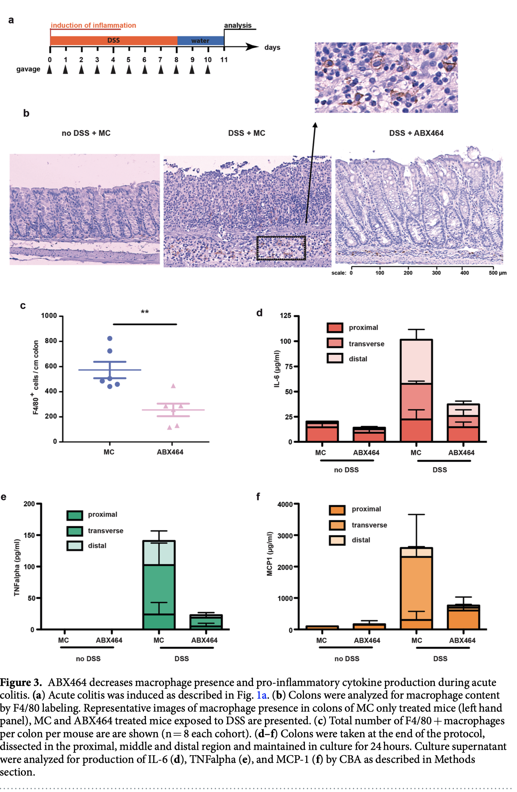
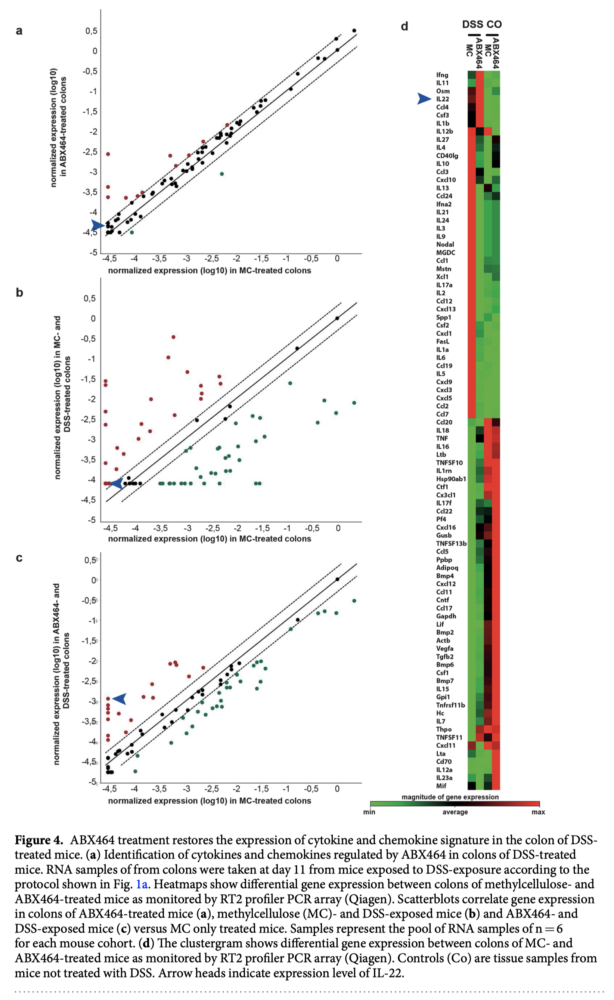
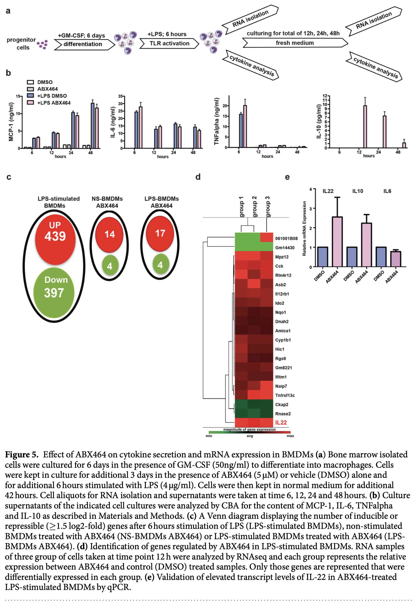

[Home](./index.html)

## Ulcerative Colitis
The primary endpoint for ulcerative colitis is measured by qualitative symptoms of stool frequency, rectal bleeding, mucosal appearance, and a physician's rating.  [@UlcerativeColitisClinical2016].

## Obefazimod

Obefazimod started off as an HIV drug and now is an Ulcerative Colitis (UC) drug [@camposLongLastingControl2015] [@tazi2010]. Then in 2017, it was discovered to have anti-inflammatory properties. [@Chebli2017] They used dextran sulfate sodium to cause colitis in mice, and then administered their drug ABX464. They measured efficicacy by tracking IL-6, TNFα and MCP-1.

The paper starts by measuring the effectiveness of ABX464 for treating DSS-induced colitis. There 2 variables that they must manage, the ABX464 efficacy, and the efficacy of the DSS. As a result they have 4 total groups consisting of: {(no disease, no drug), (no diesease, drug), (disease, no drug), (disease,drug)}. Figure A describes the administration protocol. They give the drug for 8 days and then wait 3 days before analyzing the results. Figure B measures the relative weight of the mice. We can observe that when DSS is given, the weight begins to decline for the both the metylcellulose control and the ABX464.

Then in another study, they administered the DSS for a total of 60 days. and ran 3 groups: ABX64, ABX64 then control, and just control. Figure 2b shows that mice with only MC quickly declined in health.

Figure 3b shows a control image of the colon and the difference of ABX464 vs the DSS + MC. We see less lesions in 3b. 3cdef shows inflammatory markers for both the MC control and the ABX464 drug.

4a shows that ABVX works completely identical to control when no DSS is shown. 4b shows the gene expression patterns when DSS is present with the control treatement, showing a wide varianc in the difference of expression during. 4c shows some reversion back to 4a, which is the gene expression when treated with ABVX. The arrow indicates the expression of IL-22, which seems to dampen the intestinal inflammation.

## References
