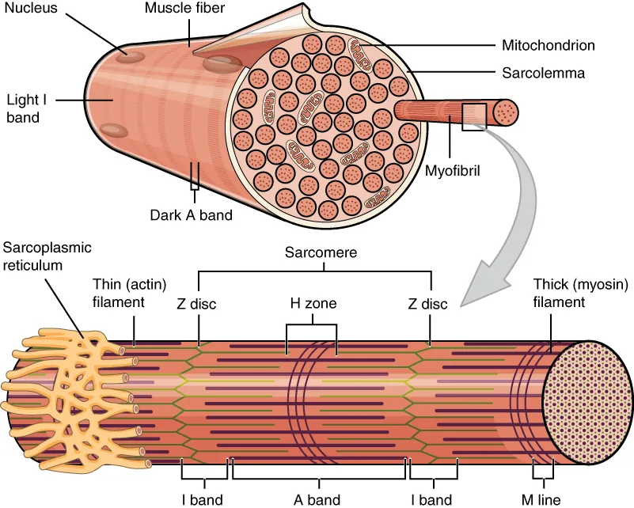

[Home](./index.html)

---

Capricor Therapeutics (CAPR) has a drug named Deramiocel (CAP-1002) to treat Duchenne muscular dystrophy. It's currently in Phase 3 and they are due to release data in a few weeks.

Martin doesn't think the drug works.

Duchenne Muscular Dystrophy is a severe X-linked recessive disorder caused by mutations in the DMD gene, which encodes a structural cytoskeletal protein in muscle cells named **dystrophin**. 

](./media/skeletal-muscle-hierarchy.png)

